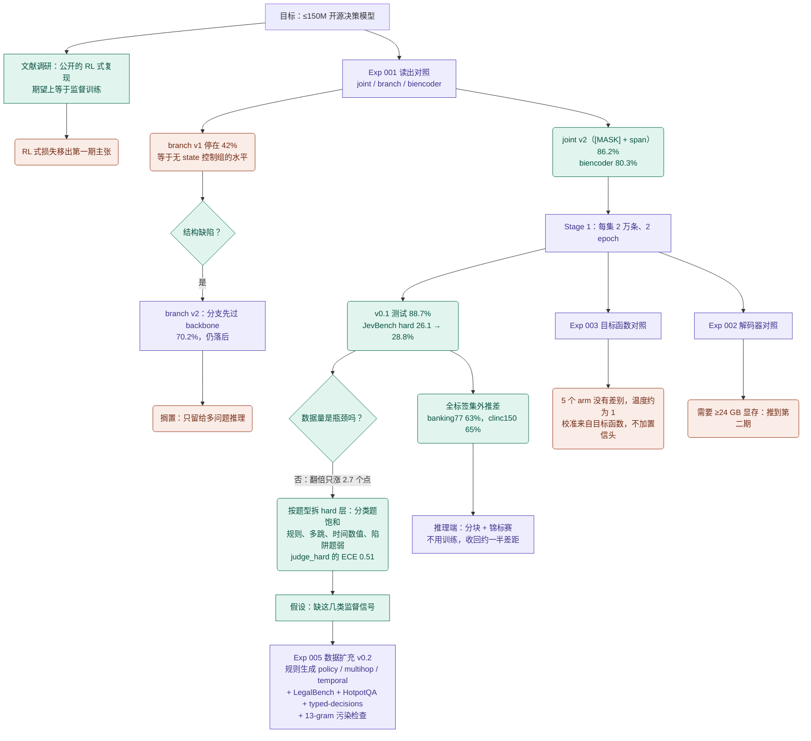
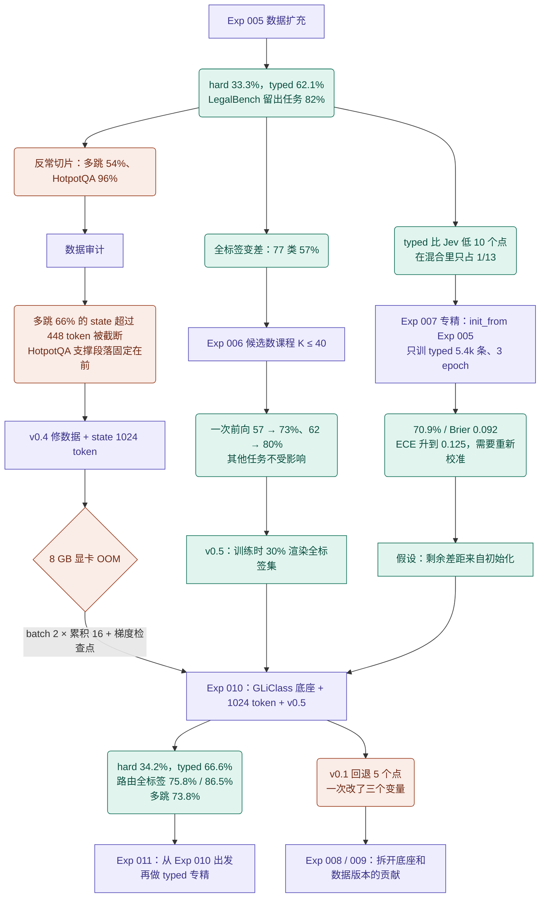
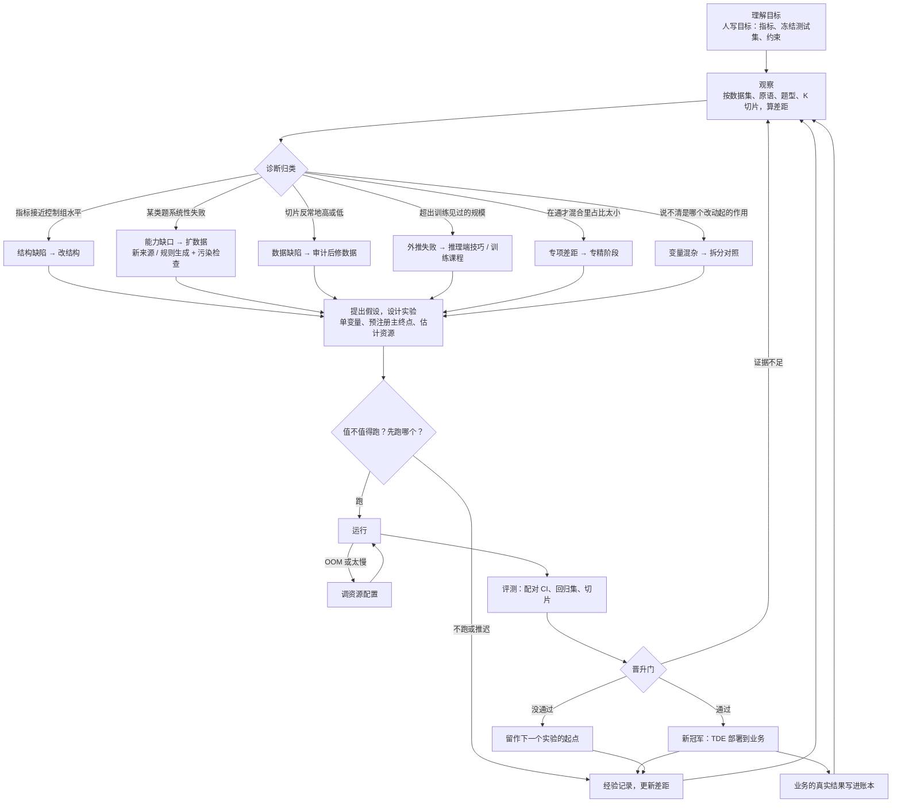

# 研究循环：从 TDE 两天的迭代看研究 agent 要做什么

> 依据 TDE 仓库 2026-09-21 ～ 22 的提交记录和 `docs/RESULTS_*.md` 整理。当时由人定方向、Claude 执行；ouroloop 的研究 agent（PLAN §5）要把这个循环自动化。

## 1. 目标怎么落到可执行的差距

| 目标 | 起点 | 目前最好 | 差距 |
|---|---|---|---|
| typed-decisions 准确率和 Brier 同时超过 Jev 1.13（72.7% / 0.148）和 verdict-2.0（77.1% / 0.064） | 零样本 36.1% / 0.278 | Exp 007：70.9% / 0.092 | Brier 已优于 Jev；准确率比 Jev 低 1.8 个点，比 verdict 低 6.2 个点 |
| JevBench hard > 40% | Stage 0：26.1% | Exp 010：34.2% | 约 6 个点（只有 111 题，CI 约 ±9） |
| 意图路由全标签集 cov@5% ≥ 90% | Stage 1：banking77 29% / clinc150 21% | Exp 010：51% / 82% | banking77 差得最多 |

约束：≤150M 参数、8 GB 显卡、按源样本切分、校准主指标不用 LLM 共识标签。

目标本身也会被修正。调研发现 verdict 已经超过 Laya，"超过 Laya"这条目标过时了，于是改成 hard > 40%，同时接受暂不追平 Jev 和 SemIf。改目标是人的决定。

## 2. 迭代全图

紫色是实验，绿色是观察和诊断，橙红色是放弃的方向或发现的问题。

### 2.1 从读出对照到数据扩充（Exp 001 → Exp 005）

### 2.2 从数据扩充到下一步（Exp 005 → Exp 011）

## 3. 每一轮的结构

| 轮 | 观察到什么 | 诊断 | 实验设计 | 结果 | 决定 |
|---|---|---|---|---|---|
| 1 | 要选读出方式 | — | Exp 001：三种读出，数据和设置相同；控制组包括无 state、打乱 state、换序 | joint v2 86.2%；branch v1 等于无 state 水平 | joint v2 作默认；branch 修结构后仍落后，搁置 |
| 2 | Stage 0 跑通 | 数据量是不是瓶颈 | Stage 1：数据翻倍、2 epoch | v0.1 +2.5 个点；hard +2.7 个点 | 数据量不是瓶颈，改按题型诊断 |
| 3 | hard 层分类题饱和，规则、多跳、时间题弱 | 缺监督信号 | Exp 005：只改训练混合，主终点是 hard 层 | hard 33.3%；typed 62.1%；LegalBench 留出任务 82% | 有效但幅度有限；审计反常切片 |
| 4 | 多跳 54%、HotpotQA 96% 反常 | 数据缺陷：截断、位置泄漏 | v0.4 修数据 + state 1024 token | 多跳 74%（Exp 010） | 修复保留 |
| 5 | 全标签外推差 | 训练只见过 ≤12 个候选 | 先试推理端分块和锦标赛（不训练），再做训练端 K ≤ 40 课程（Exp 006） | 一次前向 57 → 73%、62 → 80% | 以训练端为主，v0.5 再加全标签渲染 |
| 6 | typed 比 Jev 低 10 个点 | 在通才混合里占比太小 | Exp 007：从 Exp 005 出发只训 typed | 70.9% / 0.092 | 专精有效；再叠到最好的底座上（Exp 011） |
| 7 | 剩余差距 | 初始化 | 换 GLiClass 底座（Exp 008 / 009 / 010） | Exp 010 多数指标最好，但 v0.1 回退 5 个点 | 拆开各因素（Exp 008 / 009） |
| 并行 | 校准从哪来 | — | Exp 003：5 个 arm，单 seed | 全部持平；perm-KL 只影响换序一致性 | 不改损失，不加置信头 |
| 资源 | 1024 token OOM；解码器要 24 GB | 显存 | batch 2 × 16 + 梯度检查点；解码器推迟 | 能跑，约 3 秒一步 | 把显存配置写成规则 |

## 4. 抽象出来的循环

图里的判断节点（诊断归类、值不值得跑）由 Jev 回答，提出假设和执行由 LLM 做。训练出来的 TDE 只用在业务里，不回到这个循环。

| 环节 | 谁来做 | 交给 Jev 的问题（TDE 里的例子） |
|---|---|---|
| 理解目标 | 人写目标；LLM 拆成指标和差距 | — |
| 诊断归类 | LLM 列出可能的原因，Jev 判断（choice） | "hard 层的失败主要属于哪类：结构缺陷、能力缺口、数据缺陷、校准问题？" → 能力缺口 |
| 要不要审计 | Jev（noul） | "多跳 54%、HotpotQA 96%，更像数据缺陷而不是能力问题吗？" → 是 |
| 设计实验 | LLM | 写 Exp 005 的数据混合、Exp 007 的 init_from 配置 |
| 值不值得跑 | Jev（noul，`worth_trying`） | "在 8 GB 显卡上跑解码器对照值得吗？" → 不值得，推到第二期 |
| 先跑哪个 | Jev（choice，`pick_target`） | "下一个先跑哪个：候选数课程、专精阶段、修数据 + 1024 token？" |
| 资源问题 | Jev（choice） | "OOM 怎么办：降 batch 加累积、梯度检查点、缩短 state、推迟？" |
| 评测、晋升、记录 | 框架 | 配对 bootstrap 和回归集；Exp 010 的 v0.1 回退会被标出来 |

## 5. 对研究 agent 设计的启发

1. **起点不等于冠军。** Exp 010 在 v0.1 上回退 5 个点，按晋升门当不了冠军，却是 Exp 011 最好的起点。
2. **一次只改一处。** Exp 010 同时改了底座、state 长度和数据版本，结果好，但说不清是哪个改动起的作用，只能再排 Exp 008 / 009 拆开。
3. **先看检出下限，再下结论。** JevBench hard 只有 111 题，CI 约 ±9 个点，四次运行的 28.8%～34.2% 全在噪声里。Exp 005 拿它当主终点，其实偏弱。
4. **好得反常也要审计。** HotpotQA 96% 不是好消息，是位置泄漏。
5. **便宜的先试。** 推理端分块加锦标赛不用训练就收回一半差距，再决定是否值得改训练。
6. **负结果也有用。** Exp 003 各 arm 持平，文献调研显示 RL 式损失等价于监督，两者省掉了后面对损失函数的投入。
7. **资源约束本身就是一个分支。** OOM 和"要 24 GB"都改变了实验计划。

第 1、2、4 条写进了 PLAN §5.1；第 3 条由晋升门的样本量检查覆盖；第 5、6、7 条由经验记录和候选里的资源估计覆盖。

## 6. 把人换成 Jev：两天里人做过哪些判断

依据 TDE 主会话的对话记录整理。

**人不在场时，循环已经在转。** 北京时间 09-21 18:48～23:11 和 23:20～次日 09:50，人没有发消息。这段时间里 Exp 006～011 的方向、排序、数据修复和 OOM 处理，都是 Claude 自己定的。缺点是提出方案和判断方案是同一个模型，判断没有校准的概率，也没有留下结构化记录。ouroloop 把判断交给 Jev，并把每次判断记进账本。

人做过的判断，以及交给 Jev 时的问法：

| 人的原话（摘要） | 交给 Jev 的问题 | 类型 | 谁来做 |
|---|---|---|---|
| "我有必要再训一遍吗？别人做过了，这期显存也不够"（Exp 002） | "解码器对照值得在 8 GB 显卡上训吗？"（state：已有公开结果、显存 8 GB） | noul | Jev |
| "是不是要等这一阶段训练完再看？说不定就不用造数据了" | "先等 Stage 1 结果，还是现在就造数据？" | choice | Jev |
| "造的数据质量达标吗？贴合真实场景吗？" | "这批合成数据是否满足：标签可程序验证、模板与标签独立、不参考基准题？" | noul | Jev，criteria 要写清 |
| "joint 恰好最有效，这个直给的结论让我不安" | "这个结论的证据够吗：有对照、有消融、样本量够？" | noul | Jev |
| "为什么训练速度变慢了" | "步速下降是否超出正常波动，需要排查吗？" | noul | Jev |
| "代码都在 GPU 主机上跑"；"Mac 上也跑一部分" | "这个任务放本机还是 GPU 主机？" | choice | Jev，或写进配置 |
| "还有必要那么多子 agent 吗？"；"AI 写的仓库不用细看" | "这项调研该投入多少：略读还是细读？" | choice | Jev |
| "继续试验；受算力限制的记进后续计划" | "这个方向继续，还是推迟到算力扩充以后？" | noul | Jev |
| "开源的话数据来源怎么讲？算作弊吗？" | 同上的数据来源检查 | noul | Jev 预筛，人确认 |
| "分两期做"；"Jev 和 SemIf 不强求"；"第一轮齐平或 SOTA 就开源" | — | — | 人，写进目标文件 |
| 主机密码、接受服务条款、重启宿主机 | — | — | 人，或写进配置 |

结论：人的判断大多是对给定情况做选择、排序、判断是否继续，都能写成 typed question；留给人的是目标、权限和对外说法。表里能交给 Jev 的判断，加上 3 个由结果证实的研究决策，整理成了 `evals/replay_tde/decisions.jsonl`，最后在 Jev 上回放。

回放结果（jev-1.13.0）：11 条全部与参考答案一致，参考答案的平均概率 0.87。state 是事后整理的，这是上限，不是公平估计；细节见 `evals/replay_tde/README.md`。
